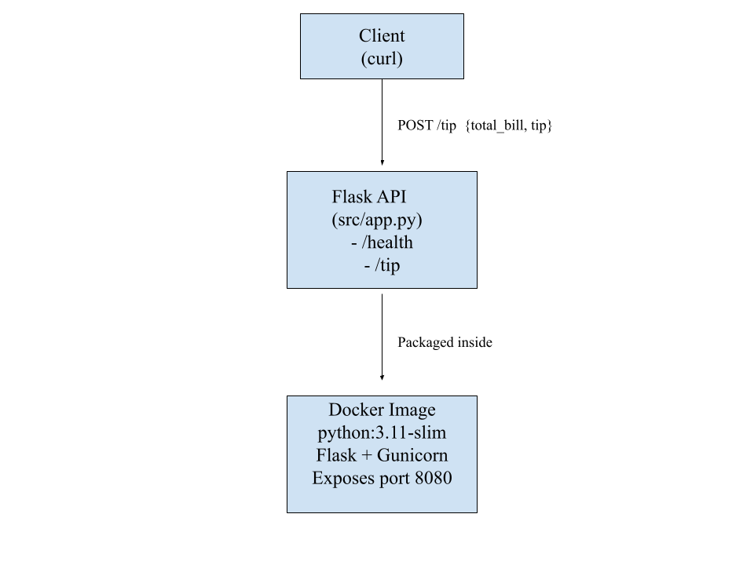
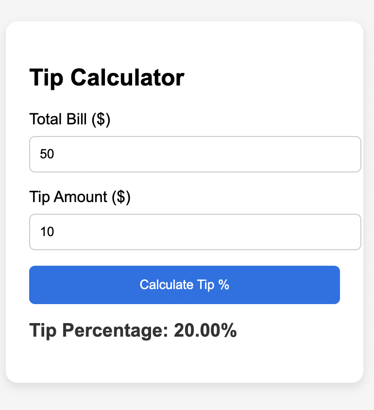

# Tip Calculator API

## 1) Executive Summary 

#### Problem 

Tipping is a common practice in many service industries, but calculating the appropriate tip percentage can sometimes be confusing. Customers often struggle to determine how much to tip based on their total bill amount, especially when paying with cash or splitting the bill among multiple people. Also it is a way for waiters and restaurant owners to ensure fair compensation for their services. 

#### Solution
This project allows you to input a total bill amount and a tip amount, and it will calculate the tip percentage for you. This can help customers quickly determine how much to tip based on their bill, ensuring fair compensation for service staff.

## 2) Project Overview

#### Course Concept(s)

This project meets the Course Concept Integration requirement because it uses a Flask API and runs it inside a Docker container, both of which we learned in class. The API has two routes and takes in numbers from the user to calculate a tip percentage. Putting the whole app into Docker makes it easy to run anywhere and keeps everything consistent.

#### Architecture Diagram



#### Data / Models / Services

Data:
This project does not use any external datasets. No data is stored.

Format: JSON
Size: Not applicable (request-time only)
License: None (no external data sources)

Models:
There is no use of machine learning models. The system performs a simple calculation (tip / total_bill) to compute the tip percentage.

Format: Not applicable
Size: Not applicable
License: Not applicable

Services:
* Flask API providing /health and /tip endpoints
* Docker container for reproducible execution environment
* No third-party APIs or cloud services are used

## 3) How to Run (Local)

``` bash 
# build the container
docker build -t tip-calculator:latest .

# run the container
docker run --rm -p 8080:8080 tip-calculator:latest

# health check
curl http://localhost:8080/health

```

## 4) Design Decisions

Course Concept Choice (Flask API & Docker):
* I chose the Flask API because it is the perfect framework for a small, fast web service. It lets me quickly set up endpoints to handle requests and return JSON responses. 
* I used Gunicorn because Flask is not designed to be a production server. Gunicorn is a Web Server Gateway Interface server that can handle multiple requests concurrently, improving the performance and reliability of the API.
* I considered just making a simple command-line tool, but Flask API shows more advanced skills in handling data with JSON. 

Tradeoffs:
* Performance vs. Simplicity: I kept the code very simple to focus on the functionality of calculating tip percentage. Yet, I used Docker and Gunicorn to ensure the service can handle multiple requests efficiently. 
* Cost: By using open-source tools like Flask and Docker, any licensing costs were avoided. The project can run on any machine with Docker installed, making it cost-effective.

Security & Privacy: 
* Input Protection: The app checks all incoming data. It makes sure total_bill and tip are numbers. If a user sends text instead, the app returns an error instead of crashing.
* Privacy: The app does not handle any personal or private data.

Operations: 
* Scaling: The app is easy to scale up by running more copies of the container when traffic increases.

Limitations: This version does not use a database, so it cannot remember past calculations or store user data.

## 5) Results & Evaluations 

Here is a sample request and response from the Tip Calculator API:
- When the app receives a $50.00 bill with a $10 tip, the request would look like this:
  


Testing Done:

* Smoke Test: The smoke_test.sh script successfully runs the app and sends a sample request to the /tip endpoint. It confirms the result is correct (0.2).

* Validation Test: We confirmed that sending incorrect data (like text instead of numbers) correctly triggers the error message, proving the app is stable.

## 6) What's Next
Future Improvements:
* Extra Features: Add a feature to suggest common tip percentages (18%, 20%, 25%).
* Extra Features: Add a "split bill" function to calculate the cost per person.

7) Links
* Github Repository: [https://github.com/lydialeelee/FinalCaseStudy]
